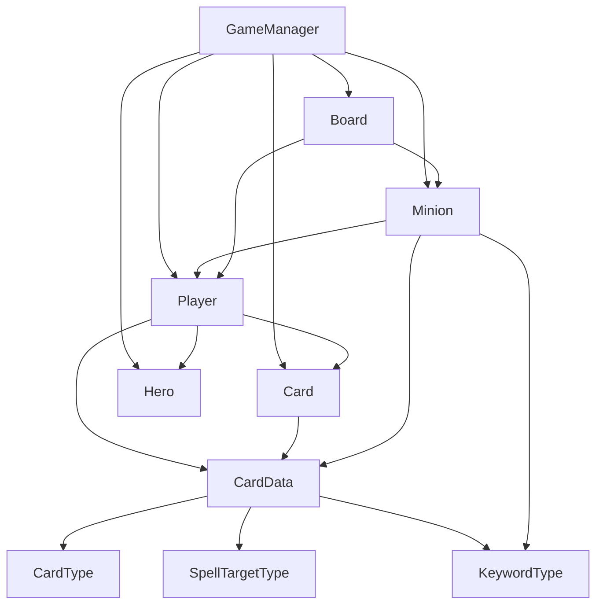

# Core Architecture

本文档只记录 Core 层架构：类职责、依赖方向、当前边界和后续扩展点。

玩家操作的详细流程放在 `Docs/04_FeatureFlows.md`。
UI 层结构放在 `Docs/03_UIArchitecture.md`。
当前进度放在 `Docs/00_CurrentStatus.md`。

## 当前目标

当前项目不是完整复刻《炉石传说》，而是先做一个单人卡牌对战 Demo 的核心规则骨架。

Core 层的目标：

```text
规则清楚
状态集中
UI 不反向控制规则
后续可以接入关键词、法术效果、事件系统和 AI
```

## 分层边界

当前项目分为两层：

```text
Core：规则和状态
UI：显示、输入和操作反馈
```

方向只能是：

```text
UI -> Core
Core 不依赖 UI
```

这意味着：

- UI 可以读取 `GameManager`、`Player`、`Board`、`Minion` 的状态。
- UI 可以调用 `GameManager.Try...` 方法发起操作。
- Core 不知道按钮、文本、Prefab、Canvas 的存在。
- 扣法力、移除手牌、造成伤害、判断胜负都必须发生在 Core。

## Core 类职责

| 类 | 文件 | 当前职责 |
|----|------|----------|
| `CardData` | `Assets/Scripts/Core/CardData.cs` | 卡牌模板数据，Unity Inspector 中配置 |
| `CardType` | `Assets/Scripts/Core/CardType.cs` | 区分随从牌和法术牌 |
| `SpellTargetType` | `Assets/Scripts/Core/SpellTargetType.cs` | 描述单目标法术可选目标范围 |
| `KeywordType` | `Assets/Scripts/Core/KeywordType.cs` | 关键词类型，当前支持冲锋 |
| `Card` | `Assets/Scripts/Core/Card.cs` | 对局中的一张卡牌实例，保存当前费用 |
| `Hero` | `Assets/Scripts/Core/Hero.cs` | 英雄生命、受伤、治疗、死亡判断 |
| `Player` | `Assets/Scripts/Core/Player.cs` | 玩家资源：英雄、手牌、牌库、法力 |
| `Minion` | `Assets/Scripts/Core/Minion.cs` | 场上随从实例：攻击、生命、所属玩家、能否攻击、关键词 |
| `Board` | `Assets/Scripts/Core/Board.cs` | 双方战场随从列表、召唤上限、移除随从 |
| `GameManager` | `Assets/Scripts/Core/GameManager.cs` | 当前阶段的对局流程调度入口 |

## 依赖关系



这张图里的重点不是箭头多少，而是方向：

```text
GameManager 调度流程。
Player 管自己的资源。
Board 管场上列表。
Minion / Hero 管自己的生命变化。
CardData 只提供模板数据。
```

## 静态数据和运行时状态

项目里最重要的一条分离：

```text
CardData = 静态模板
Card = 手牌/牌库中的运行时卡牌
Minion = 战场上的运行时随从
```

例子：

```text
一张 2 费 3/2 的卡牌模板是 CardData。
牌库和手牌里的每一张牌是 Card。
打到场上以后，它变成 Minion，并拥有当前生命、是否能攻击等状态。
```

这个分离的价值：

- 不会在运行时修改 ScriptableObject 模板。
- 同一张模板可以创建多张运行时卡牌。
- 后续减费、Buff、受伤、圣盾等运行时变化有地方存。

## 当前规则入口

`GameManager` 当前提供这些主要规则入口：

| 方法 | 用途 |
|------|------|
| `StartNewGame()` | 创建玩家、战场、起手牌并进入第一回合 |
| `StartTurn(Player targetPlayer)` | 切换当前玩家、补法力、抽牌、重置攻击权限 |
| `EndTurn()` | 结束当前回合并进入对手回合 |
| `TryPlayMinionCard(Card card)` | 尝试打出随从牌并召唤随从 |
| `TryPlaySpellCardOnMinion(Card card, Minion target)` | 尝试对随从释放伤害法术 |
| `TryPlaySpellCardOnHero(Card card, Hero targetHero)` | 尝试对英雄释放伤害法术 |
| `TryAttackMinion(Minion attacker, Minion target)` | 尝试随从攻击随从 |
| `TryAttackHero(Minion attacker, Hero targetHero)` | 尝试随从攻击英雄 |
| `CleanupDeadMinions()` | 清理死亡随从 |
| `CheckGameOver()` | 检查胜负 |

`TryPlayMinionCard()` 当前还会在召唤成功后调用 `ApplySummonKeywords(minion)`。
这个方法只处理召唤时立刻生效的关键词，目前只有冲锋。

这些方法返回 `bool` 的含义通常是：

```text
true = 操作成功
false = 操作失败
```

UI 可以根据返回值显示反馈，但不能自己绕过规则修改状态。

## 当前阶段性简化

这些做法是为了学习和原型速度，后续会逐步替换：

| 当前做法 | 为什么现在可以 | 后续何时调整 |
|----------|----------------|--------------|
| `GameManager` 直接结算基础伤害法术 | 当前只有一张单目标伤害法术 | 法术类型变多时抽出 `EffectSystem` |
| `GameManager` 直接处理攻击和反击 | 攻击规则还简单 | 嘲讽、圣盾、剧毒等机制出现时抽出 `CombatResolver` |
| `GameManager` 直接处理冲锋 | 冲锋只改召唤后的攻击权限 | 召唤触发效果变多时抽出召唤/事件处理 |
| `GameManager` 直接清理死亡随从 | 当前死亡只需要移除 | 亡语出现时抽出 `DeathProcessor` |
| UI 手动调用 `RefreshAll()` | 操作链路短、方便学习 | 事件系统稳定后再做事件驱动刷新 |
| 反馈文本由 `GameUIController` 拼接 | 当前只服务演示和调试 | 需要日志、动画、音效时再抽操作结果对象 |

面试时可以这样解释：

```text
阶段 1 到 2.1 我优先完成最小可玩闭环，所以 GameManager 承担了较多调度职责。
在进入关键词后，我会根据复杂度逐步拆出战斗结算、死亡处理、效果系统和事件总线。
```

## 冲锋实现结论

阶段 2.2 已完成第一个关键词“冲锋”。

当前链路：

```text
CardData.Keywords 配置 Charge
Minion 创建时复制 CardData.Keywords
GameManager.TryPlayMinionCard() 召唤 Minion
ApplySummonKeywords(minion) 识别 Charge
minion.SetCanAttack(true)
CardView 显示“冲锋”
```

这个实现暂时不需要完整事件系统，因为冲锋只影响随从上场后的 `CanAttack` 初始状态。

当前编辑器取舍：

```text
CardData 使用 List<KeywordType> 让 Unity Inspector 方便配置。
CleanKeywords() 用 HashSet<KeywordType> 去重。
KeywordType.None 保留为编辑期占位，避免 Inspector 点 + 后元素立刻被清掉。
HasKeyword(KeywordType.None) 仍然返回 false，所以 None 不会成为有效关键词。
```

这是阶段性简化，不是成熟项目最终做法。

成熟项目通常会把关键词设计成更独立的能力或效果模块，例如：

```text
KeywordType
KeywordInstance
EffectSystem
GameEventBus
CombatResolver
```

本项目现在已经把第一个关键词跑通，并让手牌 UI 显示“冲锋”。如果继续做展示收尾，可以让 `MinionView` 也显示场上随从关键词；如果继续扩展规则，再进入嘲讽。

## 后续拆分点

当这些现象出现时，再考虑拆系统：

| 现象 | 建议拆出的系统 |
|------|----------------|
| 攻击前需要检查嘲讽、冰冻、沉默等多个规则 | `CombatResolver` |
| 造成伤害前后会被圣盾、法伤、免疫等修改 | `DamageResolver` 或 `CombatResolver` |
| 随从死亡会触发亡语、复生、召唤等效果 | `DeathProcessor` |
| 战吼、亡语、回合开始、受伤等都要触发效果 | `GameEventBus` |
| 法术效果包含伤害、治疗、Buff、抽牌、召唤 | `EffectSystem` |
| AI 需要枚举合法操作并模拟结果 | `ActionGenerator` 和 `AIController` |

当前不急着拆这些系统，因为过早抽象会让学习成本变高。

## 核心原则

继续开发时优先守住这几条：

- 模板数据和运行时状态分离。
- Core 不依赖 UI。
- UI 不直接修改规则状态。
- 新功能先让最小链路跑通，再抽象。
- 每次只增加能解释清楚的复杂度。

下一步继续写代码前，仍然先写属性清单，再动代码。
