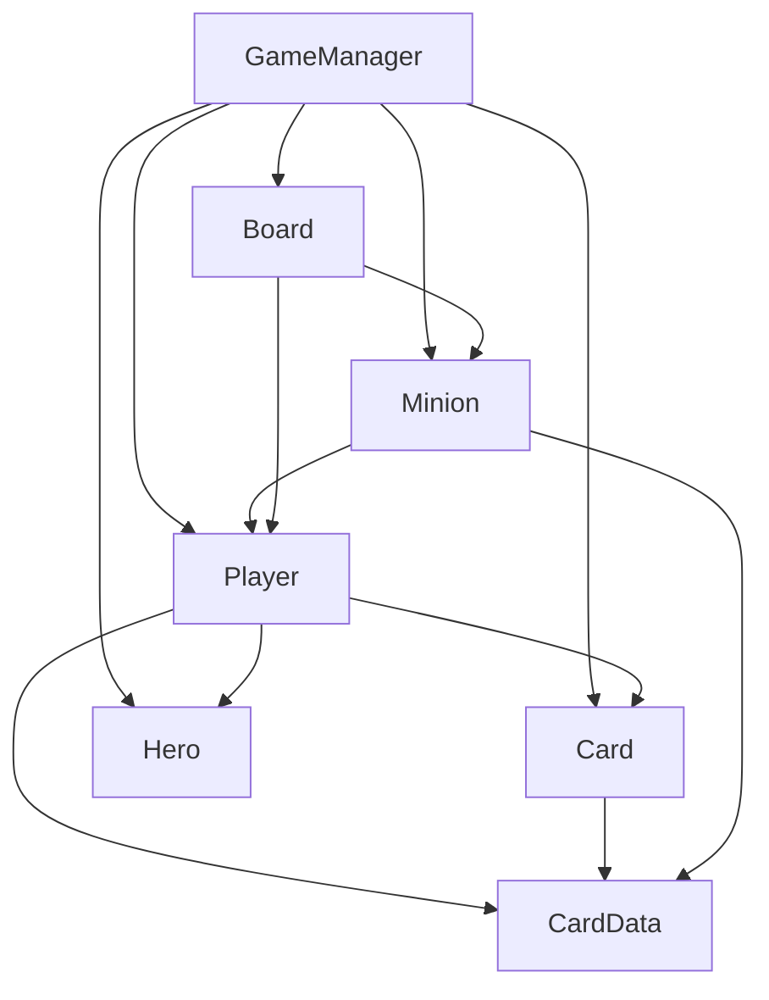
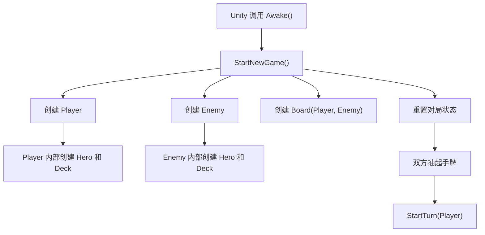
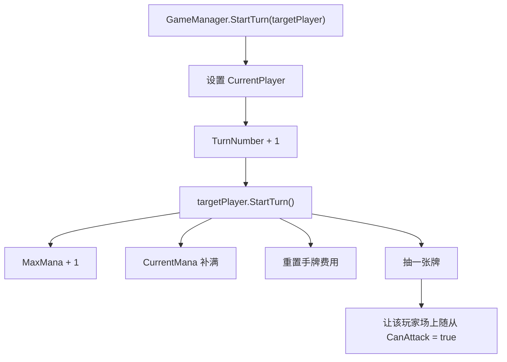
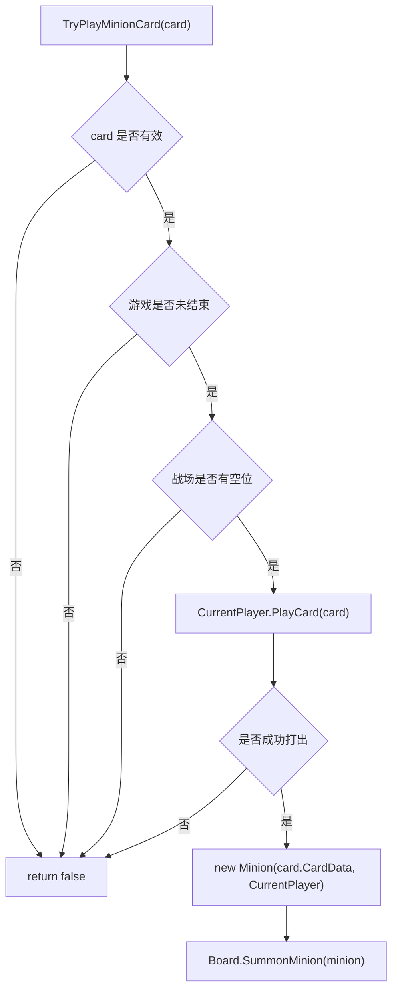
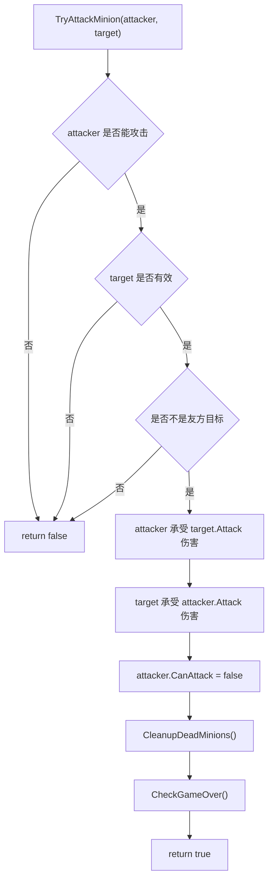
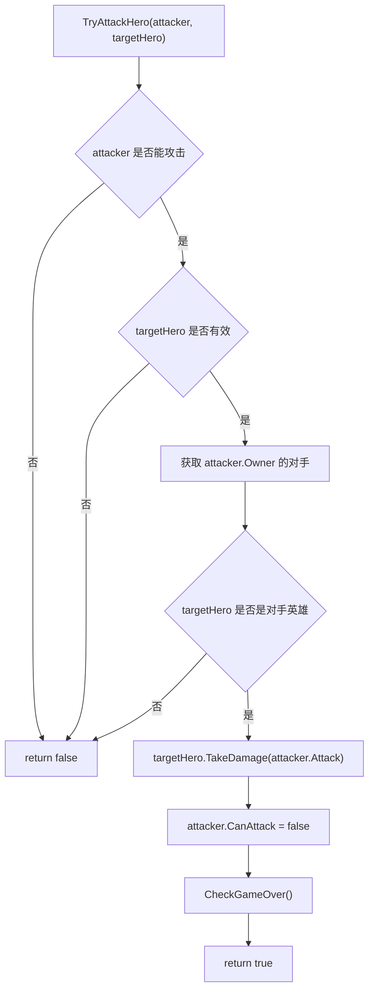
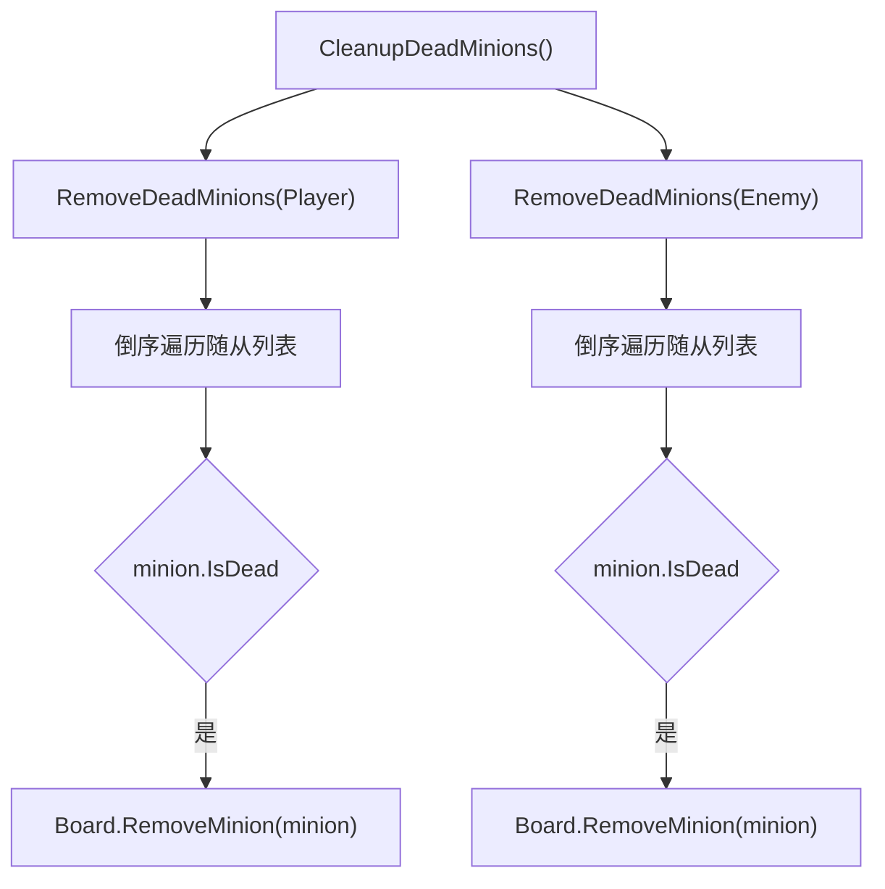
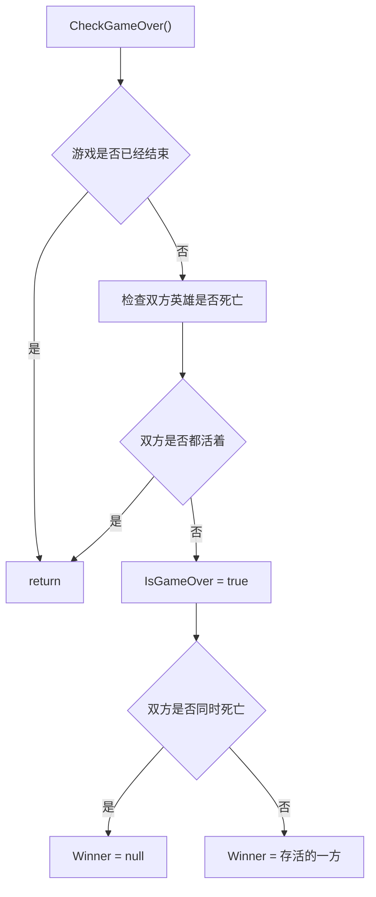

# Core Architecture

本文档用于梳理当前阶段的底层核心代码结构。

当前目标不是还原完整《炉石传说》，而是先搭出一个清晰、可解释、可扩展的单人卡牌对战原型内核。

## 当前范围

已完成的核心类：

| 类 | 文件 | 主要职责 |
|----|------|----------|
| `CardData` | `Assets/Scripts/Core/CardData.cs` | 卡牌模板数据，存储名称、费用、攻击、血量、描述 |
| `Card` | `Assets/Scripts/Core/Card.cs` | 对局中的一张卡牌实例，引用 `CardData`，保存当前费用 |
| `Hero` | `Assets/Scripts/Core/Hero.cs` | 英雄血量、受伤、治疗、死亡判断 |
| `Player` | `Assets/Scripts/Core/Player.cs` | 玩家资源：英雄、手牌、牌库、法力水晶、抽牌、出牌 |
| `Minion` | `Assets/Scripts/Core/Minion.cs` | 场上随从实例，保存攻击、生命、所属玩家、能否攻击 |
| `Board` | `Assets/Scripts/Core/Board.cs` | 战场，管理双方场上的随从列表 |
| `GameManager` | `Assets/Scripts/Core/GameManager.cs` | 对局流程，负责开局、回合、出牌、攻击、死亡清理、胜负判断 |

当前 UI 表现层已有第一版原型，详见 `Docs/03_UIArchitecture.md`。

当前还没有进入：

- 法术牌
- 武器牌
- 英雄技能
- 关键词
- 事件系统
- AI 对手

## 总体设计思路

当前核心代码按“职责”拆分，而不是把所有逻辑写进一个脚本。

可以把一局游戏理解成：

```text
GameManager 是裁判和导演
Player 是玩家资源
Board 是战场
CardData 是卡牌模板
Card 是手牌/牌库中的卡牌实例
Minion 是场上的随从实例
Hero 是玩家的生命主体
```

这样拆分的目的：

- 每个类只负责一类问题。
- UI 以后只读取和调用核心逻辑，不直接决定规则。
- 后续加入法术、关键词、AI 时，不需要推翻当前结构。
- 面试时可以清楚解释“数据、状态、规则、表现”的边界。

## 类职责说明

### CardData

`CardData` 是卡牌模板。

它继承自 `ScriptableObject`，用于在 Unity 里创建 `.asset` 数据文件。

它保存的是“这张卡原本是什么”：

```text
名称
费用
攻击
血量
描述
```

设计原因：

```text
卡牌模板属于静态配置数据。
它不应该在一局游戏运行时被随便修改。
```

例子：

```text
同一张 2费 2/3 的卡牌，可以在牌库里出现多张。
这些卡牌共享同一个 CardData 模板。
```

### Card

`Card` 是对局中的一张真实卡牌。

它引用一个 `CardData`，并额外保存运行时状态：

```text
CurrentCost
```

设计原因：

```text
CardData 是模板。
Card 是这一局里真实存在的一张卡。
```

例如后续有减费效果：

```text
模板费用仍然是 3。
但当前手牌里的这张 Card 可能临时变成 1 费。
```

这就是“静态数据”和“运行时实例”的分离。

### Hero

`Hero` 负责英雄生命相关逻辑。

它保存：

```text
Name
MaxHealth
CurrentHealth
IsDead
```

它提供：

```text
TakeDamage()
Heal()
```

设计原因：

```text
英雄死亡是游戏胜负判断的关键。
英雄血量逻辑应该独立存在，而不是散落在 GameManager 里。
```

### Player

`Player` 负责玩家资源。

它保存：

```text
Hero
Hand
Deck
MaxMana
CurrentMana
```

它提供：

```text
StartTurn()
DrawCard()
PlayCard()
ShuffleDeck()
```

设计原因：

```text
手牌、牌库、法力水晶都属于玩家。
所以这些逻辑由 Player 管理。
```

`Player.PlayCard(card)` 只负责：

```text
检查卡牌是否能从手牌打出
扣除法力
从手牌移除
返回成功或失败
```

它不负责把卡牌变成随从。

原因是：

```text
“打出一张牌”属于玩家资源变化。
“召唤到战场”属于战场和对局流程。
```

### Minion

`Minion` 是已经上场的随从。

它保存：

```text
CardData
Owner
Attack
MaxHealth
CurrentHealth
CanAttack
IsDead
```

它提供：

```text
TakeDamage()
Heal()
SetCanAttack()
```

设计原因：

```text
Card 是手牌或牌库里的对象。
Minion 是战场上的对象。
两者所处区域不同，运行时状态也不同。
```

例如：

```text
一张手牌没有 CurrentHealth。
一个场上随从才有当前生命值、能否攻击等状态。
```

### Board

`Board` 管理双方场上的随从列表。

它保存：

```text
playerMinions
enemyMinions
maxMinionsPerSide
```

它提供：

```text
CanSummon()
SummonMinion()
RemoveMinion()
GetMinions()
```

设计原因：

```text
战场站位是一个独立概念。
Board 只关心谁场上有哪些随从、还能不能放随从。
```

`Board` 不负责：

```text
攻击结算
死亡结算
UI 刷新
胜负判断
```

这些由 `GameManager` 或后续系统处理。

### GameManager

`GameManager` 是当前阶段的对局总控。

它负责：

```text
创建玩家和战场
开局抽牌
开始回合
结束回合
尝试出牌
尝试攻击
清理死亡随从
检查胜负
```

设计原因：

```text
GameManager 不代表某个玩家，也不代表某张牌。
它像裁判一样调度各个核心对象。
```

当前它直接处理出牌和攻击流程。

后续系统变复杂后，可以逐渐拆分为：

```text
TurnSystem
CombatResolver
DeathProcessor
EffectSystem
GameEventBus
```

但在阶段 1，先集中在 `GameManager` 里更容易学习和调试。

## 引用关系

当前核心类依赖关系：



用文字表示：

```text
GameManager
├── Player
├── Enemy
├── Board
├── CurrentPlayer
└── Winner

Player
├── Hero
├── Hand: List<Card>
└── Deck: List<Card>

Card
└── CardData

Minion
├── CardData
└── Owner: Player

Board
├── Player 的随从列表
└── Enemy 的随从列表
```

重要边界：

```text
Core 层目前不依赖 UI。
UI 以后可以依赖 Core。
Core 不应该反过来调用 UI。
```

## 开局流程

对应 `GameManager.Awake()` 和 `GameManager.StartNewGame()`。



流程说明：

```text
1. Unity 进入 Play 模式后自动调用 Awake。
2. Awake 调用 StartNewGame。
3. StartNewGame 创建双方 Player。
4. Player 构造函数把 CardData 列表转换成 Card 牌库。
5. 创建 Board，并告诉 Board 本局双方是谁。
6. 双方抽起手牌。
7. 进入玩家第一个回合。
```

## 回合开始流程

对应 `GameManager.StartTurn()` 和 `Player.StartTurn()`。



设计说明：

```text
Player 管自己的资源变化。
GameManager 管回合切换和场上随从攻击权限。
```

## 出牌召唤流程

对应 `GameManager.TryPlayMinionCard()`。



这里分成两步：

```text
1. Player.PlayCard:
   检查手牌、费用，扣法力，从手牌移除。

2. Board.SummonMinion:
   把新创建的 Minion 放到当前玩家的战场列表。
```

设计原因：

```text
玩家资源变化归 Player。
战场变化归 Board。
整体流程由 GameManager 调度。
```

## 随从攻击随从流程

对应 `GameManager.TryAttackMinion()`。



当前攻击规则：

```text
随从攻击随从时，双方互相造成攻击力数值的伤害。
攻击后，攻击者本回合不能再攻击。
死亡随从会被清理出战场。
```

当前暂未处理：

```text
嘲讽
圣盾
剧毒
风怒
攻击动画
```

## 随从攻击英雄流程

对应 `GameManager.TryAttackHero()`。



设计说明：

```text
不能攻击自己的英雄。
只能攻击本局对手的 Hero。
英雄死亡后由 CheckGameOver 判断胜负。
```

## 死亡清理流程

对应 `GameManager.CleanupDeadMinions()` 和 `RemoveDeadMinions()`。



为什么倒序遍历：

```text
遍历 List 时如果要删除元素，正序删除可能跳过元素。
倒序删除时，受影响的是已经检查过的后方元素，所以更安全。
```

这个细节已记录在 `Docs/Learning/CSharpNotes.md`。

## 胜负判断流程

对应 `GameManager.CheckGameOver()`。



当前规则：

```text
玩家英雄死亡，敌方获胜。
敌方英雄死亡，玩家获胜。
双方同时死亡，Winner 为 null，表示平局。
```

## 核心设计原则

### 1. 静态数据和运行时状态分离

```text
CardData = 静态模板
Card = 对局中的卡牌实例
Minion = 场上的随从实例
```

这样后续做卡牌效果时，不会污染原始模板数据。

### 2. 规则层和 UI 层分离

当前核心类都不依赖 UI。

未来 UI 的方向应该是：

```text
UI 读取 Core 状态
UI 调用 GameManager 方法
Core 不直接操作 UI
```

例如：

```text
手牌 UI 读取 Player.Hand
结束回合按钮调用 GameManager.EndTurn()
战场 UI 读取 Board.GetMinions()
点击手牌调用 GameManager.TryPlayMinionCard(card)
```

### 3. GameManager 调度，不独占所有职责

`GameManager` 负责流程，但它不应该包办所有细节。

例如：

```text
抽牌逻辑在 Player
随从列表在 Board
伤害和治疗在 Hero / Minion
```

这样做可以避免 `GameManager` 变成一个过大的脚本。

### 4. 用返回值表达操作是否成功

当前很多方法返回 `bool`：

```text
PlayCard()
SummonMinion()
TryPlayMinionCard()
TryAttackMinion()
TryAttackHero()
```

含义通常是：

```text
true  = 操作成功
false = 操作失败
```

这方便 UI 或 AI 后续判断：

```text
如果操作成功，就刷新表现。
如果操作失败，就不做表现，或者提示玩家。
```

## 当前架构边界

当前阶段为了保持简单，`GameManager` 直接负责了很多流程。

这是阶段 1 合理的做法，因为现在目标是：

```text
快速得到最小可玩核心
让玩家能出牌、攻击、结束游戏
```

但随着功能变多，未来可以拆分：

| 未来系统 | 可能职责 |
|----------|----------|
| `TurnSystem` | 专门管理回合开始、结束、当前玩家 |
| `CombatResolver` | 专门处理攻击、伤害、反击 |
| `DeathProcessor` | 专门处理死亡、亡语、死亡后清理 |
| `GameEventBus` | 派发事件，例如回合开始、随从受伤、随从死亡 |
| `EffectSystem` | 结算卡牌效果、关键词效果 |
| `AIController` | 根据当前状态决定敌方行动 |

## 和成熟卡牌项目的关系

成熟的卡牌游戏项目不会只靠一个 `GameManager`。

但它们通常也会有类似概念：

```text
卡牌配置数据库
运行时卡牌实例
玩家状态
战场状态
行动/命令系统
效果结算系统
事件系统
表现层
AI 或服务器权威逻辑
```

本项目当前架构是这些概念的最小版本。

求职时可以这样表达：

```text
我先把卡牌游戏拆成数据、运行时对象、玩家资源、战场和对局流程几个核心模块。
阶段 1 中 GameManager 承担主要调度职责。
后续加入关键词和法术时，会通过事件总线和效果系统继续拆分结算逻辑。
```

## UI 接入方向

当前 UI 已经接入第一版显示和出牌交互，设计原则仍然是：UI 不应该重新实现规则。

UI 应该做：

```text
显示 Player.Hand
显示 Board.GetMinions(Player / Enemy)
显示 Hero.CurrentHealth
显示 CurrentMana / MaxMana
把玩家点击转换成 GameManager 方法调用
```

UI 不应该做：

```text
自己判断法力是否足够并直接扣法力
自己把卡牌从手牌删除
自己修改随从列表
自己判断胜负
```

规则仍然留在 Core 层。

这样项目会更容易维护，也更接近成熟项目的分层方式。
