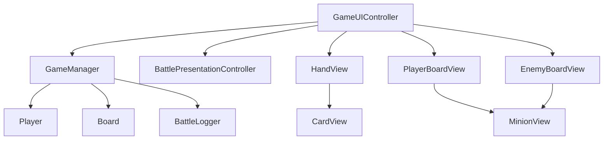

# UI Architecture

本文档记录当前 UI 层的结构。

当前 UI 的目标不是做出最终美术效果，而是让 Core 层逻辑在 Unity 里可见、可点击、可刷新。

## 当前范围

已完成的 UI 脚本：

| 类 | 文件 | 主要职责 |
|----|------|----------|
| `CardView` | `Assets/Scripts/UI/Views/CardView.cs` | 显示一张手牌，区分随从/法术的基础数值显示，显示关键词、战吼和亡语文字，点击后把 `Card` 通知给上层 |
| `HandView` | `Assets/Scripts/UI/Views/HandView.cs` | 根据当前玩家手牌生成多个 `CardView` |
| `MinionView` | `Assets/Scripts/UI/Views/MinionView.cs` | 显示一个场上随从，点击后把 `Minion` 通知给上层，并显示选中高亮 |
| `BoardView` | `Assets/Scripts/UI/Views/BoardView.cs` | 根据战场列表生成多个 `MinionView`，并传递随从点击回调和选中状态 |
| `GameUIController` | `Assets/Scripts/UI/Controllers/GameUIController.cs` | 连接 UI 和 `GameManager`，处理出牌、法术选目标、英雄技能选目标、攻击、结束回合、普通反馈、胜负提示和刷新 |
| `BattlePresentationController` | `Assets/Scripts/UI/Controllers/BattlePresentationController.cs` | 根据 Core 结算后的 `BattleLogEntry` 播放基础音效和通用 UI 脉冲表现 |
| `KeywordTextFormatter` | `Assets/Scripts/UI/Formatters/KeywordTextFormatter.cs` | 把关键词枚举转换成 UI 显示文本，供 `CardView` 和 `MinionView` 复用 |

当前还没有做：

- 拖拽出牌
- 具体目标动画，例如卡牌飞行、随从受击闪烁、英雄受击反馈
- 敌方手牌隐藏
- 最终视觉样式和完整美术资源
- 英雄技能独立图标、动画和冷却表现
- 独立的法术类型/效果显示区域
- 独立的随从 Ready、关键词、亡语显示区域
- `HandView` / `BoardView` 的 View 复用刷新

## 总体思路

当前 UI 遵守一个原则：

```text
Core 负责规则。
UI 负责显示和把玩家点击转成 Core 方法调用。
```

UI 不直接修改手牌、法力、战场和英雄血量。

例如，点击一张手牌时：

```text
UI 不自己扣法力
UI 不自己删除手牌
UI 不自己添加随从
```

而是调用：

```csharp
gameManager.TryPlayMinionCardDetailed(card);
```

然后再刷新显示。

阶段 2.1 中，法术牌也遵守这个原则：

```text
UI 不自己扣法力
UI 不自己删除手牌
UI 不自己造成伤害
```

而是根据玩家点击调用：

```csharp
gameManager.TryPlaySpellCardOnMinionDetailed(card, target);
gameManager.TryPlaySpellCardOnHeroDetailed(card, targetHero);
```

这些详细结果方法返回 `GameActionResult`。
UI 只读取成功状态和反馈文本，不自己推断实际伤害、费用不足或目标非法原因。

## 类职责说明

### CardView

`CardView` 表示屏幕上的一张手牌。

它显示：

```text
卡牌名
费用
随从牌：攻击 / 生命
法术牌：法术伤害 / 空生命位
关键词
战吼
亡语
描述
```

它保存：

```text
card
onClicked
```

`card` 是当前 UI 正在显示的运行时卡牌。

`onClicked` 是点击回调。它的意思是：

```text
这张卡被点击时，通知上层。
```

`CardView` 不引用 `GameManager`，因为单张卡牌 UI 不应该知道游戏规则。

阶段 2.1 中，`CardView` 会根据 `CardData.CardType` 做最小显示区分：

```text
Minion：显示 Attack 和 Health
Spell：显示 SpellDamage，Health 位置留空
```

这是阶段性简化。
成熟项目会给法术牌单独的版式、图标或字段标签。

阶段 2.2 中，`CardView` 会把 `CardData.Keywords` 转成中文文字，并复用 `descriptionText` 显示：

```text
Charge -> 冲锋
Taunt -> 嘲讽
```

这是阶段性简化。
当前没有新增关键词 Text，也没有改 `CardViewPrefab` 布局；后续正式 UI 可以改成独立标签或图标。

阶段 2.4 / 2.4.5 中，`CardView` 也会把 `CardData.BattlecryType` 和 `BattlecryValue` 转成中文文字，并继续复用 `descriptionText` 显示：

```text
战吼：对敌方英雄造成 1 点伤害
```

战吼只显示在手牌上，不显示在 `MinionView` 上，因为战吼是打出时触发的一次性效果，不是场上持续状态。

阶段 2.6 中，`CardView` 会把 `CardData.DeathrattleType` 和 `DeathrattleValue` 转成中文文字，并继续复用 `descriptionText` 显示：

```text
亡语：对敌方英雄造成 1 点伤害
```

### HandView

`HandView` 表示手牌区域。

它负责：

```text
清空旧手牌 UI
读取当前手牌列表
为每张 Card 创建一个 CardView
把点击回调传给 CardView
```

它不负责判断卡牌能不能打出。

### MinionView

`MinionView` 表示屏幕上的一个随从。

它显示：

```text
随从名
攻击
当前生命
是否可以攻击
关键词
亡语
是否被选中
```

当前阶段它只负责显示和转发点击。
它会把点击到的 `Minion` 通知给 `GameUIController`。
真正的攻击规则仍然由 `GameManager` 判断。
选中高亮只表现 UI 状态，不参与规则判断。

阶段 2.2 / 2.3 中，`MinionView` 曾复用 `canAttackText` 显示 Ready 和关键词：

```text
Ready 冲锋
嘲讽
Ready 嘲讽
```

这是当时的阶段性简化。
阶段 4.4 已经拆成 `statusText`、`keywordText` 和 `deathrattleText`。

阶段 2.6 中，`MinionView` 曾继续复用 `canAttackText` 显示亡语摘要：

```text
亡语:1
Ready 亡语:1
Ready 嘲讽 亡语:1
```

这是当时的阶段性简化。
阶段 4.4 后，亡语摘要由 `deathrattleText` 单独显示。

### BoardView

`BoardView` 表示一方战场。

项目里会有两个 `BoardView`：

```text
PlayerBoardView
EnemyBoardView
```

它们分别显示玩家和敌方场上的随从列表。
刷新时 `GameUIController` 会把 `selectedAttacker` 传进来，`BoardView` 再告诉每个 `MinionView` 自己是否需要高亮。

### GameUIController

`GameUIController` 是 UI 层入口。

它负责：

```text
找到或引用 GameManager
刷新手牌
刷新双方战场
刷新法力、回合、英雄血量
处理结束回合按钮
处理点击手牌
处理法术牌选择目标
处理英雄技能选择目标
处理点击随从
处理点击英雄
显示操作反馈
```

它是 UI 和 Core 之间的桥。

阶段 4.1 后，UI 反馈分成两类：

```text
规则结果反馈：优先读取 GameActionResult.Message
UI 操作状态反馈：GameUIController 自己显示
```

规则结果包括费用不足、目标非法、嘲讽限制、游戏结束、英雄技能本回合已使用、圣盾抵消等。
这些结果来自 `GameManager` 的验证和结算，UI 不再重复判断。

UI 操作状态包括：

```text
已选择某张法术牌，请选择法术目标
已选中某个随从，请选择攻击目标
已选择英雄技能，请选择敌方目标
请先选择攻击者 / 法术 / 英雄技能
取消当前选择
```

这些状态只描述玩家下一次点击会被 UI 解释成什么，不修改 Core 规则状态。

当前攻击交互流程：

```text
点击己方随从 -> 调用 GameManager.ValidateAttack(...)
验证通过后记录 selectedAttacker
刷新战场 -> 被选中的 MinionView 高亮
点击敌方随从 -> 调用 GameManager.TryAttackMinionDetailed(...)
点击敌方英雄 -> 调用 GameManager.TryAttackHeroDetailed(...)
攻击后清空 selectedAttacker，读取 GameActionResult.Message 显示反馈并刷新 UI
```

当前法术交互流程：

```text
点击法术牌 -> 调用 GameManager.ValidatePlaySpellCard(...)
验证通过后记录 selectedSpellCard
显示“请选择法术目标”
点击随从 -> 调用 GameManager.TryPlaySpellCardOnMinionDetailed(...)
点击英雄 -> 调用 GameManager.TryPlaySpellCardOnHeroDetailed(...)
施放后读取 GameActionResult.Message，清空 selectedSpellCard，显示反馈并刷新 UI
```

当前英雄技能交互流程：

```text
点击英雄技能按钮 -> 调用 GameManager.ValidateHeroSkill(...)
验证通过后记录 isSelectingHeroSkillTarget = true
点击敌方随从 -> 调用 GameManager.TryUseHeroSkillOnMinionDetailed(...)
点击敌方英雄 -> 调用 GameManager.TryUseHeroSkillOnHeroDetailed(...)
结算后清空 isSelectingHeroSkillTarget，显示 GameActionResult.Message，并刷新 UI
```

`selectedSpellCard`、`selectedAttacker` 和 `isSelectingHeroSkillTarget` 都属于 UI 层的“当前操作选择状态”。
它们只负责记录玩家下一次点击想做什么，不直接修改 Core 规则状态。
`ClearOperationSelection()` 用于统一清空这三种状态，避免切换操作时残留旧选择。

阶段 4.5 第一刀后，`GameUIController` 还会在 Core 操作成功后触发基础表现：

```text
玩家点击 UI
-> GameManager 完成规则结算
-> GameManager / BattleLogger 记录 BattleLogEntry
-> GameUIController 找到本次操作后新增的最后一条日志
-> BattlePresentationController 根据日志类型播放音效和通用 UI 脉冲
```

这个流程仍然保持 UI 不决定规则结果。费用不足、目标非法等失败操作不会播放战斗表现；出牌、攻击、法术、英雄技能、圣盾抵消、回合切换和游戏结束等成功结算才会触发表现。

### BattlePresentationController

`BattlePresentationController` 是阶段 4.5 新增的第一版战斗表现入口。

它负责：

```text
接收一条 BattleLogEntry
根据 BattleLogEntryType 选择对应 AudioClip
通过 AudioSource.PlayOneShot() 播放一次性音效
让 DefaultPulseTarget 做一次轻微缩放脉冲
```

它不负责：

```text
判断伤害是否生效
判断圣盾是否抵消
判断随从是否死亡
判断游戏是否结束
移动卡牌或随从
修改 Core 状态
```

当前音效映射：

```text
TurnStarted / TurnEnded -> Turn Started Clip
CardPlayed / MinionSummoned -> Card Played Clip
Attack -> Attack Clip
Spell / HeroSkill / Battlecry / Deathrattle / Damage -> Damage Clip
DivineShieldPrevented -> Divine Shield Clip
MinionDied -> Death Clip
GameEnded -> Game Ended Clip
```

Unity Editor 绑定：

```text
BattlePresentationController 物体上挂 BattlePresentationController
同一个物体上挂 AudioSource，Play On Awake 关闭，Spatial Blend 设为 2D
GameUIController 的 Presentation Controller 字段绑定这个物体
Default Pulse Target 当前可以绑定 FeedbackText 或反馈区域
音效资源放在 Assets/Audio/SFX
```

当前导入的音效资源：

```text
Assets/Audio/SFX
来源：Kenney Casino Audio
许可证：CC0
```

阶段性简化：

```text
当前只播放一条关键日志对应的基础表现。
当前多个伤害来源共用 Damage Clip。
当前只做通用 UI 脉冲，不做具体目标闪烁或飞行动画。
下一刀再考虑把随从 View、英雄按钮和卡牌 View 映射到具体表现目标。
```

## 引用关系



文字版：

```text
GameUIController 读取 GameManager 当前状态
HandView 根据只读的 Player.Hand 创建 CardView
BoardView 根据 Board.GetMinions(...) 创建 MinionView
玩家点击 UI 后，GameUIController 调用 GameManager 方法
GameUIController 使用反馈文本显示费用不足、不能攻击、目标非法等操作结果
阶段 2.10 中，随从出牌和法术释放反馈改为读取 GameActionResult.Message
阶段 4.1 中，法术选牌、攻击者选择、法术目标、英雄技能目标和攻击目标的主要规则失败反馈都改为读取 GameActionResult.Message
阶段 4.5 中，GameUIController 会把成功操作产生的 BattleLogEntry 交给 BattlePresentationController 播放基础音效和通用 UI 脉冲
阶段 2.2 / 2.3 中，CardView 和 MinionView 会显示关键词文字，GameUIController 不参与这件事
阶段 2.4 中，CardView 会显示战吼文字，GameUIController 也不参与这件事
阶段 2.6 中，CardView 和 MinionView 会显示亡语文字，GameUIController 仍然不参与这件事
```

## 当前刷新方式

当前阶段暂时使用手动刷新：

```csharp
RefreshAll();
```

例如：

```text
点击手牌后刷新
结束回合后刷新
```

UI 刷新还没有使用事件系统，原因是：

```text
当前操作链路还比较短，手动刷新更直观。
规则层的事件系统已经用于出牌、召唤、死亡和亡语；UI 刷新后续再考虑事件驱动。
```

## 后续 UI 优化计划

UI 拆分和复用刷新暂时延后，等功能更完整后统一整理。
后续 UI 优化目标不是重做美术，而是把临时复用的显示区域拆清楚，让更多卡牌效果、AI 自动行动和演示更稳定。

### 反馈文本拆分

阶段 4.1 已经拆成：

```text
FeedbackText：费用不足、目标非法、请选择目标、圣盾抵消等普通操作反馈
GameOverText：只显示胜负结果
```

代码上 `GameUIController` 已新增 `feedbackText` 字段。
`RefreshFeedbackText()` 只刷新普通反馈；`RefreshGameOverText()` 只刷新胜负提示。
游戏未结束时，`GameOverText` 会清空并隐藏。

Unity Editor 已做或需要保持：

- 在 Canvas / HUD 区域新增或整理一个 `FeedbackText`。
- 把它绑定到 `GameUIController`。
- `GameOverText` 只用于游戏结束。

### 阶段 4.3：战斗界面信息层级

阶段 4.3 主要是 Editor / Prefab 布局阶段，不新增 C# 类。
当前代码已经负责运行时变化：血量、法力、当前回合、普通反馈、胜负提示、英雄按钮高亮、英雄技能按钮状态、结束回合按钮状态和目标高亮。

做之前先学：

```text
Canvas：所有 UGUI 物体的根节点。
RectTransform：控制 UI 位置、宽高、锚点和轴心。
Anchor：决定 UI 跟随屏幕哪一侧或哪一区域缩放。
Layout Group：让手牌、战场随从按规则自动排列。
```

本阶段要建立的屏幕区域：

```text
EnemyArea：敌方信息区，包含敌方英雄血量、敌方战场、必要时显示敌方资源。
BattlefieldArea：主要战场区，敌方随从在上，玩家随从在下，中间留攻击和目标选择空间。
PlayerArea：玩家操作区，包含玩家英雄血量、法力、英雄技能、结束回合按钮和手牌。
FeedbackArea：当前回合状态和最近反馈，放在玩家扫视路径上。
GameOverArea：只显示胜负结果，可以覆盖或居中显示，但平时隐藏。
```

建议的 Unity 层级命名：

```text
Canvas
├── EnemyArea
│   ├── EnemyHeroButton
│   ├── EnemyHeroText
│   └── EnemyBoardView
├── BattlefieldArea
│   ├── EnemyBoardContainer
│   └── PlayerBoardContainer
├── PlayerArea
│   ├── PlayerHeroButton
│   ├── PlayerHeroText
│   ├── ManaText
│   ├── HeroSkillButton
│   ├── EndTurnButton
│   └── HandView
├── FeedbackArea
│   ├── CurrentPlayerText
│   ├── TurnText
│   └── FeedbackText
└── GameOverText
```

如果当前场景已有不同命名，不需要为了命名强行重建。优先保持 Inspector 绑定不丢，必要时只重命名空父物体或逐个拖拽归类。

Editor 调整顺序：

1. 先复制或备份 `BattlePrototype` 场景，避免误删绑定后难恢复。
2. 在 `Canvas` 下整理 4 个空父物体：`EnemyArea`、`BattlefieldArea`、`PlayerArea`、`FeedbackArea`。
3. 把敌方英雄、敌方血量和敌方战场放到上方；把玩家战场、玩家英雄、法力、英雄技能、结束回合和手牌放到下方。
4. `EnemyBoardView` 和 `PlayerBoardView` 的容器尽量使用水平排列，最多 7 个随从时仍不遮挡英雄和手牌。
5. `HandView` 放在最底部，手牌可以略微重叠，但卡名、费用和主要数值必须可读。
6. `ManaText`、`HeroSkillButton`、`EndTurnButton` 放在玩家操作区右侧或下方固定位置，形成稳定操作区。
7. `CurrentPlayerText`、`TurnText`、`FeedbackText` 放在中下方或右侧信息区，不要盖住随从和手牌。
8. `GameOverText` 平时隐藏，结束时显示在中心偏上或中心位置，不和普通反馈共用同一块 Text。

代码与 Editor 分工：

| 内容 | 放哪里 | 原因 |
|------|--------|------|
| 血量、法力、当前回合、按钮状态、高亮颜色 | 代码 / Inspector 字段 | 运行时会变化，需要由 `GameUIController` 刷新 |
| 位置、宽高、字号、颜色、边距、背景色块 | Unity Editor / Prefab | 静态视觉参数不应该硬编码 |
| 手牌和战场排列方式 | Editor 的 Layout Group / RectTransform | 属于布局规则，方便边看边调 |
| 费用不足、目标非法、胜负结果文本 | 代码读取 Core 结果 | 不能让 UI 自己猜规则 |

验收清单：

- 5 秒内能看出：谁的回合、双方血量、当前法力、手牌、双方场面、最近一次操作反馈。
- 敌方区、战场区、玩家操作区一眼可分，不依赖说明文字才能理解。
- 选中攻击者、法术或英雄技能时，目标高亮不被其他 UI 遮挡。
- 手牌最多 7-10 张时，卡牌仍能点击，核心数值不被遮住。
- 双方各 7 个随从时，随从不会盖住英雄血量、反馈文本或结束回合按钮。
- `FeedbackText` 和 `GameOverText` 仍然分别绑定到 `GameUIController`，普通反馈不会覆盖胜负提示。
- Play 模式里完成一次：出牌、攻击、法术、英雄技能、结束回合、胜负显示。

阶段性简化：

```text
当前继续使用 UGUI Text 和简洁色块，不做最终美术。
当前不手写响应式布局代码，先用 Anchor 和 Layout Group 解决常见屏幕比例。
当前不改 CardViewPrefab / MinionViewPrefab 的字段拆分，这部分留到阶段 4.4。
```

面试表达：

```text
阶段 4.3 我没有把 UI 位置写死在代码里，因为位置、字号、边距属于表现配置，应该交给 Prefab 和 Scene。
代码只负责运行时状态，例如当前回合、法力、按钮可用、高亮和 Core 返回的反馈文本。
这样后续换美术、改分辨率或调整布局时，不需要动核心规则代码。
```

### 卡牌显示拆分

阶段 4.4 代码层已让 `CardView` 拆分卡牌类型和法术效果文本。
当前要求 `CardViewPrefab` 绑定 `typeText` 和 `effectText`，不再保留旧 Prefab 的法术伤害回退显示。

当前显示策略：

```text
随从牌：显示攻击 / 生命
法术牌：显示类型和效果，例如“法术”“造成 2 点伤害”
规则文本区：显示关键词、法术效果、战吼和亡语
描述区：只显示 CardData.Description
```

代码字段：

```text
typeText：显示“随从 / 法术”
effectText：显示规则文本，例如“嘲讽”“造成 2 点伤害”“战吼：抽 1 张牌”
descriptionText：只显示 CardData.Description
```

`CardView` 不再自己维护战吼和亡语文案。
关键词、法术效果、战吼和亡语文案已经统一到 `CardTextFormatter.GetCardEffectText()`，避免以后多个 View 各写一套 `switch`。

Unity Editor 需要做：

- 回到 Unity，让 Unity 自动导入 `CardTextFormatter.cs` 并生成 `.meta`。
- 在 `CardViewPrefab` 中新增或整理两个 `Text`：`TypeText` 和 `EffectText`。
- 把 `TypeText` 拖到 `CardView` 的 `Type Text` 字段。
- 把 `EffectText` 拖到 `CardView` 的 `Effect Text` 字段。
- 把 `EffectText` 和 `DescriptionText` 做成上下两个不同区域，避免规则文本和描述重叠。
- 绑定完成后，法术牌的攻击位置会固定清空，法术效果显示在 `EffectText`。

### 随从状态拆分

阶段 4.4 代码层已让 `MinionView` 拆分 Ready、关键词和亡语文本。
当前要求 `MinionViewPrefab` 绑定 `statusText`、`keywordText` 和 `deathrattleText`，不再保留旧的 `CanAttackText` 合并显示。

当前显示策略：

```text
StatusText：Ready
KeywordText：冲锋 / 嘲讽 / 圣盾
DeathrattleText：亡语:1
```

代码字段：

```text
statusText：只显示 Ready
keywordText：只显示关键词
deathrattleText：只显示亡语短文本
```

Unity Editor 需要做：

- 在 `MinionViewPrefab` 中新增或整理 3 个 `Text`：`StatusText`、`KeywordText`、`DeathrattleText`。
- 把它们分别拖到 `MinionView` 的 `Status Text`、`Keyword Text`、`Deathrattle Text` 字段。
- 原来的 `CanAttackText` 可以从 Prefab 上删除，或保留为未绑定的普通物体；代码不再读取它。
- Play 模式检查普通随从、冲锋随从、嘲讽随从、圣盾随从和亡语随从的显示是否清楚。

### 文本格式化统一

当前关键词已经由 `KeywordTextFormatter` 统一。
阶段 4.4 新增了 `CardTextFormatter`，用于整理战吼、亡语和法术效果文本。

当前分工：

```text
KeywordTextFormatter：关键词文本，例如“冲锋 / 嘲讽 / 圣盾”
CardTextFormatter：卡牌类型、法术效果、战吼文本、亡语完整文本、亡语短文本
CardView：读取 formatter 结果并刷新手牌 UI
MinionView：读取 formatter 结果并刷新场上随从 UI
```

新增简单效果文案时，优先改 formatter，不在多个 View 里复制 `switch`。

### 基础音效和通用脉冲

阶段 4.5 第一刀已接入基础表现入口。

代码与 Editor 分工：

| 内容 | 放哪里 | 原因 |
|------|--------|------|
| 根据 `BattleLogEntryType` 选择音效 | `BattlePresentationController` | 属于运行时表现逻辑 |
| `AudioSource`、`AudioClip`、默认脉冲目标 | Unity Editor / Inspector | 属于资源和表现配置 |
| 实际伤害、圣盾抵消、死亡、胜负 | Core / `GameManager` | 属于规则结果，UI 只读取 |
| 音效文件和许可证 | `Assets/Audio/SFX` | 资源集中管理，方便提交和检查授权 |

当前播放链路：

```text
Core 规则结算成功
-> BattleLogger 记录日志
-> GameUIController 找到新日志
-> BattlePresentationController 播放音效和通用脉冲
```

面试表达：

```text
我没有让动画或音效决定规则结果，而是让 Core 先完成结算，再把结算日志交给表现层播放。
这样可以避免 UI 自己猜伤害、圣盾、死亡等结果，也方便以后把表现升级成队列。
```

### 刷新方式优化

当前 `HandView` / `BoardView` 每次刷新都会：

```text
Destroy 旧 View
Instantiate 新 View
重新绑定点击
```

卡牌少时可以接受，但后续加入动画、选中状态、AI 自动行动和更多日志时，会不稳定也浪费。

后续计划改成简单复用：

```text
已有 View 足够：复用并刷新数据
已有 View 不够：补 Instantiate
已有 View 多余：SetActive(false)
Clear()：隐藏而不是销毁
```

这不是完整对象池系统，只是阶段性整理。
完整对象池等动画和复杂 UI 出现后再考虑。

## Unity 对象关系

当前场景中需要有：

```text
Canvas
EventSystem
GameManager
GameUIController
BattlePresentationController
HandView
PlayerBoardView
EnemyBoardView
AudioSource
EndTurnButton
PlayerHeroButton
EnemyHeroButton
若干 Text
```

阶段 1.5 中，`GameOverText` 曾在游戏未结束时复用为操作反馈文本；游戏结束后仍然显示胜负结果。
阶段 2.1 继续复用这块文本显示法术选择和法术结算反馈。
阶段 2.2 的手牌关键词文字复用 `CardView` 的 `Description Text`，没有新增 Prefab 字段。
阶段 2.3 的场上随从关键词文字复用 `MinionView` 的 `CanAttackText`，没有新增 Prefab 字段。
阶段 2.4 的手牌战吼文字继续复用 `CardView` 的 `Description Text`，没有新增 Prefab 字段。
阶段 2.6 的手牌亡语文字继续复用 `CardView` 的 `Description Text`，场上亡语文字继续复用 `MinionView` 的 `CanAttackText`，没有新增 Prefab 字段。
阶段 2.9 已把关键词文本格式化抽到 `KeywordTextFormatter`。
阶段 4.1 已拆分 `FeedbackText` 和 `GameOverText`，并整理三种 UI 选择状态。
阶段 4.4 已拆分卡牌类型、法术效果、随从 Ready、关键词和亡语文本。
阶段 4.5 第一刀已新增 `BattlePresentationController`，并通过 `GameUIController` 在成功操作后触发基础音效和通用 UI 脉冲。
后续仍计划优化刷新复用。

Prefab：

```text
Assets/Prefabs/UI/CardViewPrefab.prefab
Assets/Prefabs/UI/MinionViewPrefab.prefab
```

`CardViewPrefab` 挂载 `CardView`。

`MinionViewPrefab` 挂载 `MinionView`。

英雄按钮当前不使用独立 `HeroView`。
做法是在玩家/敌方英雄血量 UI 物体上添加 `Button`，再绑定到 `GameUIController` 的 `Player Hero Button` 和 `Enemy Hero Button` 字段。

## 面试表达

可以这样说明当前 UI 设计：

```text
当前 UI 层只负责表现和输入，不负责规则。
单张卡牌由 CardView 显示，手牌区域由 HandView 批量生成。
战场随从由 MinionView 显示，BoardView 负责显示一方战场。
GameUIController 作为 UI 层入口，把出牌、随从攻击随从、随从攻击英雄等点击操作转换成 GameManager 的规则方法调用。
阶段 1.5 中，选中高亮和操作提示属于 UI 层反馈；阶段 2.1 中，法术选目标也属于 UI 层操作状态。
阶段 2.2 / 2.3 中，关键词显示属于纯表现层逻辑，CardView 读取 CardData.Keywords，MinionView 读取 Minion.Keywords，不判断关键词规则。
阶段 2.4 / 2.4.5 中，战吼显示也属于纯表现层逻辑，CardView 读取 CardData.BattlecryType 和 BattlecryValue，不执行战吼效果。
阶段 2.6 中，亡语显示也属于纯表现层逻辑，CardView 和 MinionView 读取 CardData.DeathrattleType 和 DeathrattleValue，不执行亡语效果。
具体规则仍由 GameManager 判断。
这样 Core 层不会依赖 UI，后续替换表现层或加入动画时，不需要修改核心规则。
```
