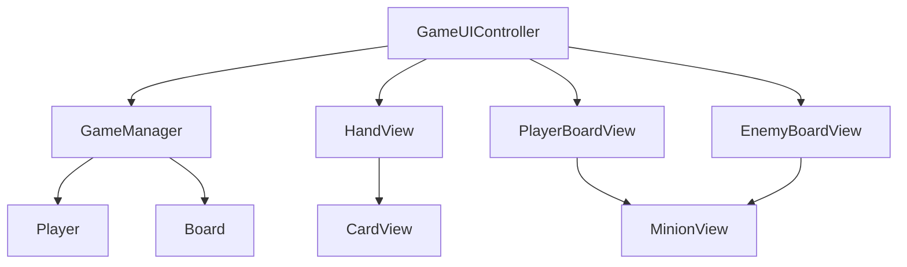

# UI Architecture

本文档记录阶段 1 当前 UI 层的结构。

当前 UI 的目标不是做出最终美术效果，而是让 Core 层逻辑在 Unity 里可见、可点击、可刷新。

## 当前范围

已完成的 UI 脚本：

| 类 | 文件 | 主要职责 |
|----|------|----------|
| `CardView` | `Assets/Scripts/UI/CardView.cs` | 显示一张手牌，点击后把 `Card` 通知给上层 |
| `HandView` | `Assets/Scripts/UI/HandView.cs` | 根据当前玩家手牌生成多个 `CardView` |
| `MinionView` | `Assets/Scripts/UI/MinionView.cs` | 显示一个场上随从 |
| `BoardView` | `Assets/Scripts/UI/BoardView.cs` | 根据战场列表生成多个 `MinionView` |
| `GameUIController` | `Assets/Scripts/UI/GameUIController.cs` | 连接 UI 和 `GameManager`，处理点击、结束回合和刷新 |

当前还没有做：

- 随从攻击点击交互
- 拖拽出牌
- 动画和音效
- 敌方手牌隐藏
- 最终视觉样式

## 总体思路

当前 UI 遵守一个原则：

```text
Core 负责规则。
UI 负责显示和把玩家点击转成 Core 方法调用。
```

UI 不直接修改手牌、法力、战场和英雄血量。

例如，点击一张手牌时：

```text
UI 不自己扣法力
UI 不自己删除手牌
UI 不自己添加随从
```

而是调用：

```csharp
gameManager.TryPlayMinionCard(card);
```

然后再刷新显示。

## 类职责说明

### CardView

`CardView` 表示屏幕上的一张手牌。

它显示：

```text
卡牌名
费用
攻击
生命
描述
```

它保存：

```text
card
onClicked
```

`card` 是当前 UI 正在显示的运行时卡牌。

`onClicked` 是点击回调。它的意思是：

```text
这张卡被点击时，通知上层。
```

`CardView` 不引用 `GameManager`，因为单张卡牌 UI 不应该知道游戏规则。

### HandView

`HandView` 表示手牌区域。

它负责：

```text
清空旧手牌 UI
读取当前手牌列表
为每张 Card 创建一个 CardView
把点击回调传给 CardView
```

它不负责判断卡牌能不能打出。

### MinionView

`MinionView` 表示屏幕上的一个随从。

它显示：

```text
随从名
攻击
当前生命
是否可以攻击
```

当前阶段它只负责显示，不负责攻击点击。

### BoardView

`BoardView` 表示一方战场。

项目里会有两个 `BoardView`：

```text
PlayerBoardView
EnemyBoardView
```

它们分别显示玩家和敌方场上的随从列表。

### GameUIController

`GameUIController` 是 UI 层入口。

它负责：

```text
找到或引用 GameManager
刷新手牌
刷新双方战场
刷新法力、回合、英雄血量
处理结束回合按钮
处理点击手牌
```

它是 UI 和 Core 之间的桥。

## 引用关系



文字版：

```text
GameUIController 读取 GameManager 当前状态
HandView 根据 Player.Hand 创建 CardView
BoardView 根据 Board.GetMinions(...) 创建 MinionView
玩家点击 UI 后，GameUIController 调用 GameManager 方法
```

## 当前刷新方式

阶段 1 暂时使用手动刷新：

```csharp
RefreshAll();
```

例如：

```text
点击手牌后刷新
结束回合后刷新
```

没有使用事件系统，原因是：

```text
阶段 1 的目标是先跑通最小可玩流程。
事件系统会在阶段 2 做关键词和法术时引入。
```

## Unity 对象关系

当前场景中需要有：

```text
Canvas
EventSystem
GameManager
GameUIController
HandView
PlayerBoardView
EnemyBoardView
EndTurnButton
若干 Text
```

Prefab：

```text
Assets/Prefabs/UI/CardViewPrefab.prefab
Assets/Prefabs/UI/MinionViewPrefab.prefab
```

`CardViewPrefab` 挂载 `CardView`。

`MinionViewPrefab` 挂载 `MinionView`。

## 面试表达

可以这样说明当前 UI 设计：

```text
阶段 1 的 UI 层只负责表现和输入，不负责规则。
单张卡牌由 CardView 显示，手牌区域由 HandView 批量生成。
战场随从由 MinionView 显示，BoardView 负责显示一方战场。
GameUIController 作为 UI 层入口，把点击操作转换成 GameManager 的规则方法调用。
这样 Core 层不会依赖 UI，后续替换表现层或加入动画时，不需要修改核心规则。
```
