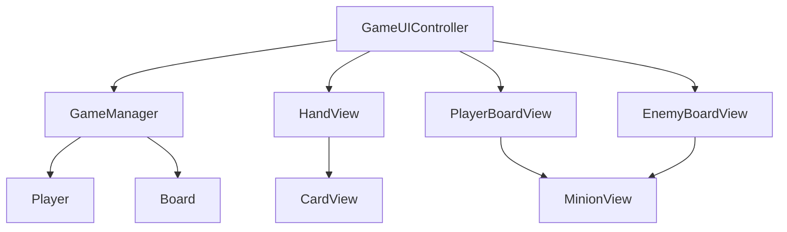

# UI Architecture

本文档记录当前 UI 层的结构。

当前 UI 的目标不是做出最终美术效果，而是让 Core 层逻辑在 Unity 里可见、可点击、可刷新。

## 当前范围

已完成的 UI 脚本：

| 类 | 文件 | 主要职责 |
|----|------|----------|
| `CardView` | `Assets/Scripts/UI/Views/CardView.cs` | 显示一张手牌，区分随从/法术的基础数值显示，显示关键词、战吼和亡语文字，点击后把 `Card` 通知给上层 |
| `HandView` | `Assets/Scripts/UI/Views/HandView.cs` | 根据当前玩家手牌生成多个 `CardView` |
| `MinionView` | `Assets/Scripts/UI/Views/MinionView.cs` | 显示一个场上随从，点击后把 `Minion` 通知给上层，并显示选中高亮 |
| `BoardView` | `Assets/Scripts/UI/Views/BoardView.cs` | 根据战场列表生成多个 `MinionView`，并传递随从点击回调和选中状态 |
| `GameUIController` | `Assets/Scripts/UI/Controllers/GameUIController.cs` | 连接 UI 和 `GameManager`，处理出牌、法术选目标、英雄技能选目标、攻击、结束回合、普通反馈、胜负提示和刷新 |
| `KeywordTextFormatter` | `Assets/Scripts/UI/Formatters/KeywordTextFormatter.cs` | 把关键词枚举转换成 UI 显示文本，供 `CardView` 和 `MinionView` 复用 |

当前还没有做：

- 拖拽出牌
- 动画和音效
- 敌方手牌隐藏
- 最终视觉样式和完整美术资源
- 英雄技能独立图标、动画和冷却表现
- 独立的法术类型/效果显示区域
- 独立的随从 Ready、关键词、亡语显示区域
- `HandView` / `BoardView` 的 View 复用刷新

## 总体思路

当前 UI 遵守一个原则：

```text
Core 负责规则。
UI 负责显示和把玩家点击转成 Core 方法调用。
```

UI 不直接修改手牌、法力、战场和英雄血量。

例如，点击一张手牌时：

```text
UI 不自己扣法力
UI 不自己删除手牌
UI 不自己添加随从
```

而是调用：

```csharp
gameManager.TryPlayMinionCardDetailed(card);
```

然后再刷新显示。

阶段 2.1 中，法术牌也遵守这个原则：

```text
UI 不自己扣法力
UI 不自己删除手牌
UI 不自己造成伤害
```

而是根据玩家点击调用：

```csharp
gameManager.TryPlaySpellCardOnMinionDetailed(card, target);
gameManager.TryPlaySpellCardOnHeroDetailed(card, targetHero);
```

这些详细结果方法返回 `GameActionResult`。
UI 只读取成功状态和反馈文本，不自己推断实际伤害、费用不足或目标非法原因。

## 类职责说明

### CardView

`CardView` 表示屏幕上的一张手牌。

它显示：

```text
卡牌名
费用
随从牌：攻击 / 生命
法术牌：法术伤害 / 空生命位
关键词
战吼
亡语
描述
```

它保存：

```text
card
onClicked
```

`card` 是当前 UI 正在显示的运行时卡牌。

`onClicked` 是点击回调。它的意思是：

```text
这张卡被点击时，通知上层。
```

`CardView` 不引用 `GameManager`，因为单张卡牌 UI 不应该知道游戏规则。

阶段 2.1 中，`CardView` 会根据 `CardData.CardType` 做最小显示区分：

```text
Minion：显示 Attack 和 Health
Spell：显示 SpellDamage，Health 位置留空
```

这是阶段性简化。
成熟项目会给法术牌单独的版式、图标或字段标签。

阶段 2.2 中，`CardView` 会把 `CardData.Keywords` 转成中文文字，并复用 `descriptionText` 显示：

```text
Charge -> 冲锋
Taunt -> 嘲讽
```

这是阶段性简化。
当前没有新增关键词 Text，也没有改 `CardViewPrefab` 布局；后续正式 UI 可以改成独立标签或图标。

阶段 2.4 / 2.4.5 中，`CardView` 也会把 `CardData.BattlecryType` 和 `BattlecryValue` 转成中文文字，并继续复用 `descriptionText` 显示：

```text
战吼：对敌方英雄造成 1 点伤害
```

战吼只显示在手牌上，不显示在 `MinionView` 上，因为战吼是打出时触发的一次性效果，不是场上持续状态。

阶段 2.6 中，`CardView` 会把 `CardData.DeathrattleType` 和 `DeathrattleValue` 转成中文文字，并继续复用 `descriptionText` 显示：

```text
亡语：对敌方英雄造成 1 点伤害
```

### HandView

`HandView` 表示手牌区域。

它负责：

```text
清空旧手牌 UI
读取当前手牌列表
为每张 Card 创建一个 CardView
把点击回调传给 CardView
```

它不负责判断卡牌能不能打出。

### MinionView

`MinionView` 表示屏幕上的一个随从。

它显示：

```text
随从名
攻击
当前生命
是否可以攻击
关键词
亡语
是否被选中
```

当前阶段它只负责显示和转发点击。
它会把点击到的 `Minion` 通知给 `GameUIController`。
真正的攻击规则仍然由 `GameManager` 判断。
选中高亮只表现 UI 状态，不参与规则判断。

阶段 2.2 / 2.3 中，`MinionView` 会复用 `canAttackText` 显示 Ready 和关键词：

```text
Ready 冲锋
嘲讽
Ready 嘲讽
```

这是阶段性简化。
正式 UI 可以把 Ready 状态和关键词拆成独立图标或标签。

阶段 2.6 中，`MinionView` 继续复用 `canAttackText` 显示亡语摘要：

```text
亡语:1
Ready 亡语:1
Ready 嘲讽 亡语:1
```

这是阶段性简化。
正式 UI 可以把亡语做成独立图标或详情面板，不和 Ready 状态挤在同一个文本里。

### BoardView

`BoardView` 表示一方战场。

项目里会有两个 `BoardView`：

```text
PlayerBoardView
EnemyBoardView
```

它们分别显示玩家和敌方场上的随从列表。
刷新时 `GameUIController` 会把 `selectedAttacker` 传进来，`BoardView` 再告诉每个 `MinionView` 自己是否需要高亮。

### GameUIController

`GameUIController` 是 UI 层入口。

它负责：

```text
找到或引用 GameManager
刷新手牌
刷新双方战场
刷新法力、回合、英雄血量
处理结束回合按钮
处理点击手牌
处理法术牌选择目标
处理英雄技能选择目标
处理点击随从
处理点击英雄
显示操作反馈
```

它是 UI 和 Core 之间的桥。

阶段 4.1 后，UI 反馈分成两类：

```text
规则结果反馈：优先读取 GameActionResult.Message
UI 操作状态反馈：GameUIController 自己显示
```

规则结果包括费用不足、目标非法、嘲讽限制、游戏结束、英雄技能本回合已使用、圣盾抵消等。
这些结果来自 `GameManager` 的验证和结算，UI 不再重复判断。

UI 操作状态包括：

```text
已选择某张法术牌，请选择法术目标
已选中某个随从，请选择攻击目标
已选择英雄技能，请选择敌方目标
请先选择攻击者 / 法术 / 英雄技能
取消当前选择
```

这些状态只描述玩家下一次点击会被 UI 解释成什么，不修改 Core 规则状态。

当前攻击交互流程：

```text
点击己方随从 -> 调用 GameManager.ValidateAttack(...)
验证通过后记录 selectedAttacker
刷新战场 -> 被选中的 MinionView 高亮
点击敌方随从 -> 调用 GameManager.TryAttackMinionDetailed(...)
点击敌方英雄 -> 调用 GameManager.TryAttackHeroDetailed(...)
攻击后清空 selectedAttacker，读取 GameActionResult.Message 显示反馈并刷新 UI
```

当前法术交互流程：

```text
点击法术牌 -> 调用 GameManager.ValidatePlaySpellCard(...)
验证通过后记录 selectedSpellCard
显示“请选择法术目标”
点击随从 -> 调用 GameManager.TryPlaySpellCardOnMinionDetailed(...)
点击英雄 -> 调用 GameManager.TryPlaySpellCardOnHeroDetailed(...)
施放后读取 GameActionResult.Message，清空 selectedSpellCard，显示反馈并刷新 UI
```

当前英雄技能交互流程：

```text
点击英雄技能按钮 -> 调用 GameManager.ValidateHeroSkill(...)
验证通过后记录 isSelectingHeroSkillTarget = true
点击敌方随从 -> 调用 GameManager.TryUseHeroSkillOnMinionDetailed(...)
点击敌方英雄 -> 调用 GameManager.TryUseHeroSkillOnHeroDetailed(...)
结算后清空 isSelectingHeroSkillTarget，显示 GameActionResult.Message，并刷新 UI
```

`selectedSpellCard`、`selectedAttacker` 和 `isSelectingHeroSkillTarget` 都属于 UI 层的“当前操作选择状态”。
它们只负责记录玩家下一次点击想做什么，不直接修改 Core 规则状态。
`ClearOperationSelection()` 用于统一清空这三种状态，避免切换操作时残留旧选择。

## 引用关系



文字版：

```text
GameUIController 读取 GameManager 当前状态
HandView 根据只读的 Player.Hand 创建 CardView
BoardView 根据 Board.GetMinions(...) 创建 MinionView
玩家点击 UI 后，GameUIController 调用 GameManager 方法
GameUIController 使用反馈文本显示费用不足、不能攻击、目标非法等操作结果
阶段 2.10 中，随从出牌和法术释放反馈改为读取 GameActionResult.Message
阶段 4.1 中，法术选牌、攻击者选择、法术目标、英雄技能目标和攻击目标的主要规则失败反馈都改为读取 GameActionResult.Message
阶段 2.2 / 2.3 中，CardView 和 MinionView 会显示关键词文字，GameUIController 不参与这件事
阶段 2.4 中，CardView 会显示战吼文字，GameUIController 也不参与这件事
阶段 2.6 中，CardView 和 MinionView 会显示亡语文字，GameUIController 仍然不参与这件事
```

## 当前刷新方式

当前阶段暂时使用手动刷新：

```csharp
RefreshAll();
```

例如：

```text
点击手牌后刷新
结束回合后刷新
```

UI 刷新还没有使用事件系统，原因是：

```text
当前操作链路还比较短，手动刷新更直观。
规则层的事件系统已经用于出牌、召唤、死亡和亡语；UI 刷新后续再考虑事件驱动。
```

## 后续 UI 优化计划

UI 拆分和复用刷新暂时延后，等功能更完整后统一整理。
后续 UI 优化目标不是重做美术，而是把临时复用的显示区域拆清楚，让更多卡牌效果、AI 自动行动和演示更稳定。

### 反馈文本拆分

阶段 4.1 已经拆成：

```text
FeedbackText：费用不足、目标非法、请选择目标、圣盾抵消等普通操作反馈
GameOverText：只显示胜负结果
```

代码上 `GameUIController` 已新增 `feedbackText` 字段。
`RefreshFeedbackText()` 只刷新普通反馈；`RefreshGameOverText()` 只刷新胜负提示。
游戏未结束时，`GameOverText` 会清空并隐藏。

Unity Editor 已做或需要保持：

- 在 Canvas / HUD 区域新增或整理一个 `FeedbackText`。
- 把它绑定到 `GameUIController`。
- `GameOverText` 只用于游戏结束。

### 卡牌显示拆分

当前 `CardView` 用攻击位置显示法术伤害，并把关键词、战吼、亡语、描述都塞进 `DescriptionText`。
这是阶段性简化，不是成熟项目最终做法。

后续计划：

```text
随从牌：显示攻击 / 生命
法术牌：显示类型和效果，例如“法术”“造成 2 点伤害”
描述区：继续显示关键词、战吼、亡语和卡牌描述，但后续可拆成独立 Text
```

代码上 `CardView` 会新增可选字段，例如 `typeText` / `effectText`。
Prefab 没绑定时，仍然保留当前旧显示方式。

Unity Editor 需要做：

- 在 `CardViewPrefab` 中增加类型/效果文本区域。
- 增大 `DescriptionText` 的可用空间，避免关键词、战吼、亡语挤在一行小框里。

### 随从状态拆分

当前 `MinionView` 复用 `CanAttackText` 显示 Ready、关键词和亡语摘要。
这会导致信息越来越挤。

后续计划：

```text
StatusText：Ready
KeywordText：冲锋 / 嘲讽 / 圣盾
DeathrattleText：亡语:1
```

代码上 `MinionView` 会新增可选字段。
Prefab 没绑定时，仍然回退到旧的合并文本。

Unity Editor 需要做：

- 在 `MinionViewPrefab` 中新增或整理 2-3 个 Text。
- `CanAttackText` 可以保留兼容，但后续不再承担所有状态。

### 文本格式化统一

当前关键词已经由 `KeywordTextFormatter` 统一。
后续计划继续整理战吼、亡语、法术效果和随从状态文本。

目标：

```text
CardView 不自己写一套战吼/亡语文案
MinionView 不自己写一套亡语摘要文案
新增效果时优先改 formatter，而不是到多个 View 里复制 switch
```

可以新增 `CardTextFormatter`，或者扩展现有 formatter。
具体写代码前先列属性清单。

### 刷新方式优化

当前 `HandView` / `BoardView` 每次刷新都会：

```text
Destroy 旧 View
Instantiate 新 View
重新绑定点击
```

卡牌少时可以接受，但后续加入动画、选中状态、AI 自动行动和更多日志时，会不稳定也浪费。

后续计划改成简单复用：

```text
已有 View 足够：复用并刷新数据
已有 View 不够：补 Instantiate
已有 View 多余：SetActive(false)
Clear()：隐藏而不是销毁
```

这不是完整对象池系统，只是阶段性整理。
完整对象池等动画和复杂 UI 出现后再考虑。

## Unity 对象关系

当前场景中需要有：

```text
Canvas
EventSystem
GameManager
GameUIController
HandView
PlayerBoardView
EnemyBoardView
EndTurnButton
PlayerHeroButton
EnemyHeroButton
若干 Text
```

阶段 1.5 中，`GameOverText` 曾在游戏未结束时复用为操作反馈文本；游戏结束后仍然显示胜负结果。
阶段 2.1 继续复用这块文本显示法术选择和法术结算反馈。
阶段 2.2 的手牌关键词文字复用 `CardView` 的 `Description Text`，没有新增 Prefab 字段。
阶段 2.3 的场上随从关键词文字复用 `MinionView` 的 `CanAttackText`，没有新增 Prefab 字段。
阶段 2.4 的手牌战吼文字继续复用 `CardView` 的 `Description Text`，没有新增 Prefab 字段。
阶段 2.6 的手牌亡语文字继续复用 `CardView` 的 `Description Text`，场上亡语文字继续复用 `MinionView` 的 `CanAttackText`，没有新增 Prefab 字段。
阶段 2.9 已把关键词文本格式化抽到 `KeywordTextFormatter`。
阶段 4.1 已拆分 `FeedbackText` 和 `GameOverText`，并整理三种 UI 选择状态。
后续仍计划拆分卡牌效果文本、随从状态文本，并优化刷新复用。

Prefab：

```text
Assets/Prefabs/UI/CardViewPrefab.prefab
Assets/Prefabs/UI/MinionViewPrefab.prefab
```

`CardViewPrefab` 挂载 `CardView`。

`MinionViewPrefab` 挂载 `MinionView`。

英雄按钮当前不使用独立 `HeroView`。
做法是在玩家/敌方英雄血量 UI 物体上添加 `Button`，再绑定到 `GameUIController` 的 `Player Hero Button` 和 `Enemy Hero Button` 字段。

## 面试表达

可以这样说明当前 UI 设计：

```text
当前 UI 层只负责表现和输入，不负责规则。
单张卡牌由 CardView 显示，手牌区域由 HandView 批量生成。
战场随从由 MinionView 显示，BoardView 负责显示一方战场。
GameUIController 作为 UI 层入口，把出牌、随从攻击随从、随从攻击英雄等点击操作转换成 GameManager 的规则方法调用。
阶段 1.5 中，选中高亮和操作提示属于 UI 层反馈；阶段 2.1 中，法术选目标也属于 UI 层操作状态。
阶段 2.2 / 2.3 中，关键词显示属于纯表现层逻辑，CardView 读取 CardData.Keywords，MinionView 读取 Minion.Keywords，不判断关键词规则。
阶段 2.4 / 2.4.5 中，战吼显示也属于纯表现层逻辑，CardView 读取 CardData.BattlecryType 和 BattlecryValue，不执行战吼效果。
阶段 2.6 中，亡语显示也属于纯表现层逻辑，CardView 和 MinionView 读取 CardData.DeathrattleType 和 DeathrattleValue，不执行亡语效果。
具体规则仍由 GameManager 判断。
这样 Core 层不会依赖 UI，后续替换表现层或加入动画时，不需要修改核心规则。
```
